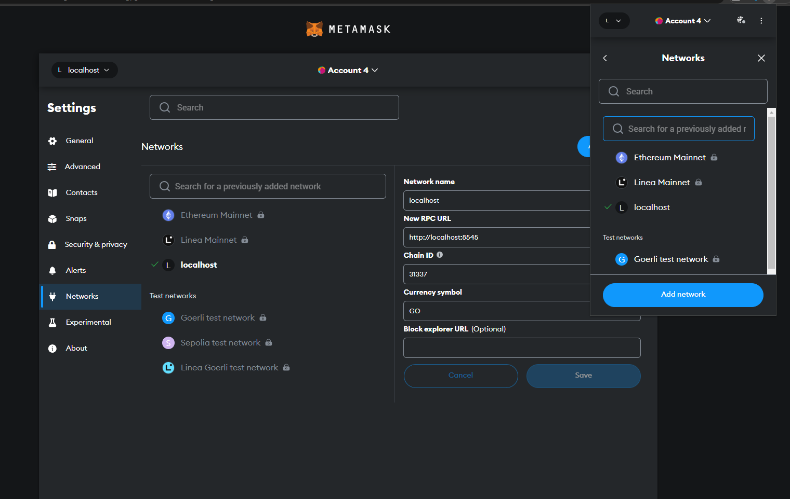
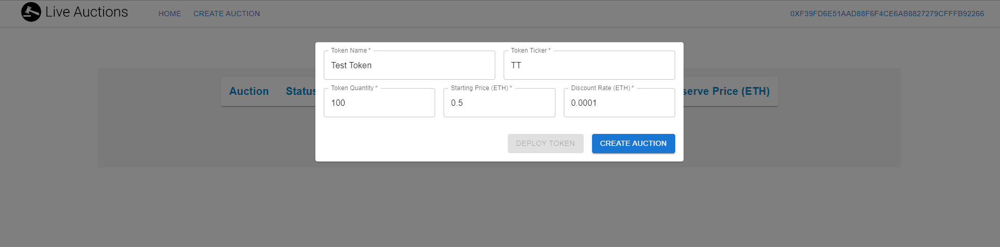
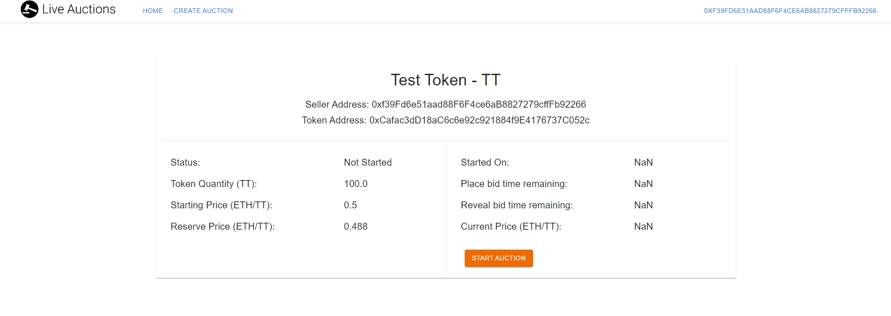
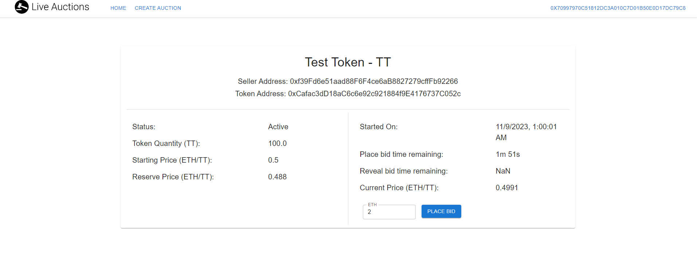
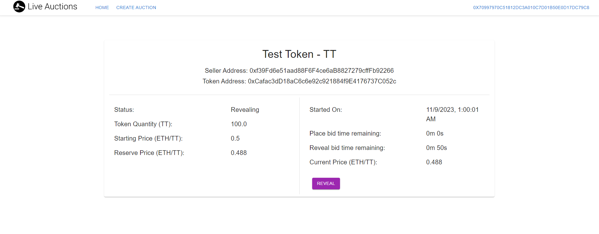
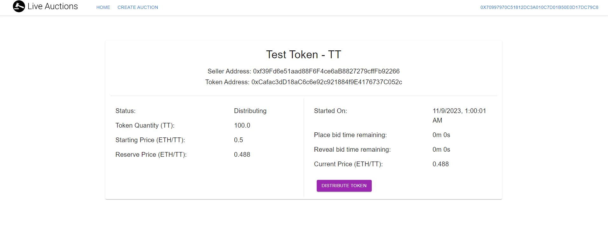

# dutch-auction

This web application is a decentralized blockchain-based platform that facilitates Dutch Auctions. It is built for the module CZ4153: Blockchain Technology offered in NTU. The price of the auction starts high and decreases linearly over time, until a buyer places a bid at an acceptable price to him. This application also supports submarine send to a hidden address for improved security.

## Table of Contents

- [dutch-auction](#dutch-auction)
  - [Table of Contents](#table-of-contents)
  - [Features](#features)
  - [Getting Started](#getting-started)
    - [Prerequisites](#prerequisites)
    - [Installation](#installation)
  - [Usage](#usage)

## Features

- React JavaScript Frontend w/ EthersJS
- Material UI styling
- Solidity (Hardhat) for contracts development
- Alchemy, Sepolia and Github Pages deployment

## Getting Started

### Prerequisites

- JS and Solidity knowledge
- An understanding of blockchain transactions

### Installation

1. Download Metamask [here](https://metamask.io/)

2. Start the node and deploy the contracts

```bash
# install contract dependencies
cd backend
npm install --force # some legacy deps

# start a local Hardhat node
npm run node

# create a new terminal
# deploy smart contracts
npm run deploy:local
```

3. Start the frontend

```bash
# install frontend dependencies
cd frontend
npm install

# start the frontend
# unix
npm run start
# windows
npm run start:windows
```

## Usage

### Watch the recording here: [https://youtu.be/z7zxEyoPRbY](https://youtu.be/z7zxEyoPRbY)

### Alternatively, here are the steps:

#### 1. Import account and add the following network to your Metamask wallet



#### 2. Deploy token and create an auction



#### 3. Start the auction



#### 4. Change an account and place a bid



#### 5. Once the place bid timing is over, reveal the bid to the auction



#### 6. Once the reveal bid timing is over, distribute the tokens to bidders


